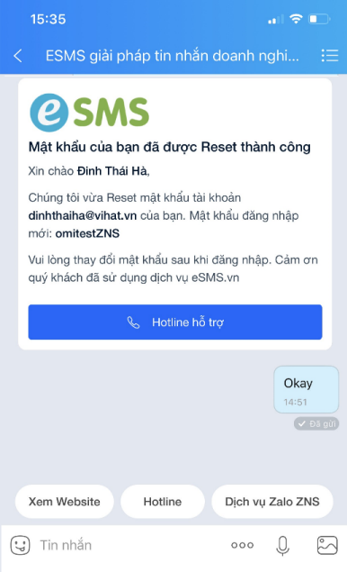

# Hàm gửi tin Zalo V4

Hàm cho phép bạn gửi tin nhắn đến 1 hoặc nhiều số điện thoại đã đăng kí Zalo. Để có thể gửi được tin ZNS bạn cần tiến hành:\
\- Đăng ký và xác thực Zalo Offical Account (Zalo OA)\
\- Đăng ký template tin nhắn\
Để hoàn thành các việc trên vui lòng liên hệ nhân viên kinh doanh hỗ trợ của bạn hoặc Hotline 0901888484\
Ví dụ 1 mẫu tin ZNS<br>

<figure><figcaption><p>Một tin ZNS mẫu</p></figcaption></figure>

## HTTP request

\
<mark style="color:yellow;">**`POST`**</mark> [https://rest.esms.vn/MainService.svc/json/SendZaloMessage\_V4\_post\_json/](https://rest.esms.vn/MainService.svc/json/SendZaloMessage_V4_post_json/)

* **Content Type:** <mark style="color:orange;">application/json</mark>
* **Response Type:** <mark style="color:orange;">application/json</mark>


```json
curl --location 'https://rest.esms.vn/MainService.svc/json/SendZaloMessage_V4_post_json/' \
--header 'Content-Type: application/json' \
--data '{
    "ApiKey": "{{ApiKey}}",
    "SecretKey": "{{SecretKey}}",
    "Phone": "{{Phone}}",
    "Params": [
        "{{value1}}",
        "{{value2}}",
        "{{value3}}"
    ],
    "TempID": "{{TempID}}",
    "OAID": "{{OAID}}",
    "SendDate": "{{SendDate}}",
    "Sandbox": "0",
    "RequestId": "{{RequestId}}",
    "campaignid": "{{campaignid}}",
    "CallbackUrl": "{{CallbackUrl}}"
}'
```


* **Cấu trúc body của request:**

<table><thead><tr><th width="156">Tham số</th><th width="145">Kiểu dữ liệu</th><th width="132" data-type="checkbox">Tính bắt buộc</th><th>Mô tả</th></tr></thead><tbody><tr><td>ApiKey</td><td>string</td><td>true</td><td>ApiKey của tài khoản.</td></tr><tr><td>SecretKey</td><td>string</td><td>true</td><td>Secretkey của tài khoản.</td></tr><tr><td>Phone</td><td>string</td><td>true</td><td>Số điện thoại nhận tin.</td></tr><tr><td>Params</td><td>string</td><td>true</td><td><p></p><p>Giá trị cần truyền cho các biến trong Template *Lưu ý:</p><ol><li>Các tham số truyền vào phải đúng thứ tự như template bạn đăng ký</li><li>Nếu tham số trùng nhau chỉ cần truyền vào một tham số</li></ol></td></tr><tr><td>TempID</td><td>string</td><td>true</td><td>Template của Zalo OA mà khách hàng đăng kí với eSMS.</td></tr><tr><td>OAID</td><td>string</td><td>true</td><td>Zalo OA ID, là ID của trang Zalo Offical Account của doanh nghiệp. Doanh nghiệp cần đăng nhập vào trang quản trị của Zalo OA để lấy phần Zalo OA ID này. <br><strong>Chú ý: sẽ phải đăng ký trước khi sử dụng.</strong></td></tr><tr><td>SendDate</td><td>string</td><td>false</td><td>Thời gian hẹn gửi của tin. <br>Không truyền khi tin muốn tin nhắn gửi đi liền.<br>Định dạng: yyyy-mm-dd hh:MM:ss.</td></tr><tr><td>Sandbox</td><td>string</td><td>false</td><td>1: Tin gửi ở môi trường test, dùng để kiểm tra kết nối và các thông số tích hợp, không về tin nhắn, không trừ tiền.<br>0: Tin gửi ở môi trường bình thường, có về tin nhắn.</td></tr><tr><td>RequestId</td><td>string</td><td>false</td><td>ID đối tác truyền sang để chặn trùng và đối soát khi cần.<br>Độ dài tối đa 50 ký tự.<br><strong>Mỗi RequestId truyền sang có hiệu lực chặn trong 24h.</strong></td></tr><tr><td>campaignid</td><td>string</td><td>false</td><td>Tên chiến dịch gửi tin, tối đa 254 ký tự.</td></tr><tr><td>CallbackUrl</td><td>string</td><td>false</td><td>URL nhận kết quả gửi tin. <br>Xem body mẫu <a href="https://samplefordevelopers.esms.vn/#b98ca55e-3001-4446-b5bb-a4ab86127b0b">ở đây</a>. <br>Xem chi tiết <a href="https://developers-v2.esms.vn/esms-api/callback-url">ở đây</a>.</td></tr><tr><td>SendingMode</td><td>string</td><td>false</td><td>Chế độ gửi:<br> <kbd><strong>1</strong></kbd> (Default): Gửi thường, tin ZNS được gửi theo cơ chế thông thường. <br><kbd><strong>3</strong></kbd>: Gửi vượt hạn mức, cho phép OA gửi tin ZNS tag 3 vượt hạn mức. <br><br><strong>Lưu ý</strong>: Chế độ Gửi vượt hạn mức (SendingMode = 3) chỉ áp dụng cho các OA được whitelist. Vui lòng liên hệ đội ngũ CSKH nếu có nhu cầu gửi ở chế độ Gửi vượt hạn mức.</td></tr></tbody></table>

***

* **Response:**



```
{
    "CodeResult": "100",
    "CountRegenerate": 0,
    "SMSID": "d8e0f1f0702544b2acb456ca9ccfd111250"
}
```

**Request hợp lệ.**



```
{
    "CodeResult": "101",
    "CountRegenerate": 0,
    "ErrorMessage": "Authorize Failed"
}
```

**Sai thông tin ApiKey/SecretKey.**



```
{
    "CodeResult": "789",
    "CountRegenerate": 0,
    "ErrorMessage": "TemplateId is not config"
}
```

**Template chưa được cấu hình cho OA ID bạn đang sử dụng.**



* **Cấu trúc body của response:**

<table><thead><tr><th width="151.73333740234375">Thuộc tính</th><th width="143.7332763671875">Kiểu dữ liệu</th><th>Mô tả</th></tr></thead><tbody><tr><td>CodeResult</td><td>string</td><td>Request được gửi đến ESMS thành công.<br><br><strong>Lưu ý:</strong> Mã phản hồi <strong>100</strong> chỉ xác nhận rằng yêu cầu đã được gửi thành công đến hệ thống ESMS, <strong>không phản ánh việc tin nhắn đã được gửi đến số điện thoại người nhận hay chưa</strong>.<br>Để theo dõi trạng thái cuối cùng của tin nhắn, quý khách vui lòng truyền thêm tham số <strong>CallbackUrl</strong>; hệ thống ESMS sẽ tự động gửi phản hồi (callback) đến địa chỉ này khi có trạng thái cuối của tin.</td></tr><tr><td>SMSID</td><td>string</td><td>ID tin nhắn do esms trả về.</td></tr><tr><td>ErrorMessage</td><td>string</td><td>Thông tin lỗi trả về (nếu có lỗi).</td></tr></tbody></table>

* _<mark style="color:yellow;">**Thông tin chi tiết mã lỗi xem ở bảng:**</mark>_ [**Mã lỗi**](../bang-ma-loi.md) **.**
* _<mark style="color:yellow;">**Lấy code mẫu của các ngôn ngữ ở link:**</mark>_ [**Code mẫu**](https://samplefordevelopers.esms.vn/#2d996c73-a5c2-45ca-973e-d18aabb960c7) **.**
