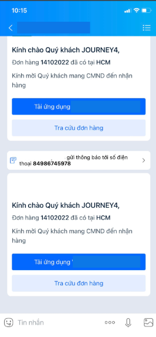

# Tin Zalo hành trình

\
Hàm cho phép bạn gửi tin nhắn đến số điện thoại đã đăng kí Zalo.&#x20;

Để có thể gửi được tin Zalo bạn cần tiến hành:\
\- Đăng ký và xác thực Zalo Offical Account (Zalo OA).\
\- Đăng ký template tin nhắn là template TIN NHẮN HÀNH TRÌNH với ZALO.\
Để hoàn thành các việc trên vui lòng liên hệ nhân viên kinh doanh hỗ trợ của bạn hoặc Hotline 0901888484.\
Ví dụ một mẫu tin Zalo hành trình.

<figure><figcaption></figcaption></figure>

## HTTP request

<mark style="color:yellow;">**`POST`**</mark> [https://rest.esms.vn/MainService.svc/json/SendZaloMessage\_V4\_post\_json/](http://rest.esms.vn/MainService.svc/json/SendZaloMessage_V4_post_json/)

* **Content Type:** <mark style="color:orange;">application/json</mark>
* **Response Type:** <mark style="color:orange;">application/json</mark>

```json
curl --location 'https://rest.esms.vn//MainService.svc/json/SendZaloMessage_V4_post_json/' \
--header 'Content-Type: application/json' \
--data '{
    "ApiKey": "{{APIKEY}}",
    "SecretKey": "{{SecretKey}}",
    "Phone": "{{Phone}}",
    "Params": ["{{PARAM1}}","{{PARAM2}}","{{PARAM3}}"],
    "IsJourney": true,
    "OrderId": "{{ORDERID}}",
    "TempID": "{{TempID}}",
    "OAID": "{{OAID}}",
    "RequestId": "{{RequestId}}",
    "campaignid": "{{campaignid}}",
    "CallbackUrl":"{{CallbackUrl}}"
}'
```

* **Cấu trúc body của request:**

<table><thead><tr><th width="142">Tham số</th><th width="148">Kiểu dữ liệu </th><th width="141" data-type="checkbox">Tính bắt buộc</th><th>Mô tả</th></tr></thead><tbody><tr><td>ApiKey</td><td>string</td><td>true</td><td>ApiKey của tài khoản.</td></tr><tr><td>SecretKey</td><td>string</td><td>true</td><td>Secretkey của tài khoản.</td></tr><tr><td>Phone</td><td>string</td><td>true</td><td>Số điện thoại nhận tin.</td></tr><tr><td>Params</td><td>Array</td><td>true</td><td><p></p><p>Giá trị cần truyền cho các biến trong Template </p><p>*Lưu ý:</p><ol><li>Các tham số truyền vào phải đúng thứ tự như template bạn đăng ký.</li><li>Nếu tham số trùng nhau chỉ cần truyền vào một tham số.</li></ol></td></tr><tr><td>IsJourney</td><td>string</td><td>true</td><td>True: Là tính tin nhắn hành trình.<br>Fale: Không phải tin nhắn hành trình.</td></tr><tr><td>OrderId</td><td>string</td><td>true</td><td>Id của hành trình, dùng để đánh dấu hành trình, bắt buộc có khi gửi tin ZNS Journey.</td></tr><tr><td>TempID</td><td>string</td><td>true</td><td>Template của Zalo OA mà khách hàng đăng kí với eSMS.<br>Đối với loại tin ZNS Journey thì cần phải đăng ký với Zalo mới sử dụng được.</td></tr><tr><td>OAID </td><td>string</td><td>true</td><td>Zalo OA ID, là ID của trang Zalo Offical Account của doanh nghiệp. Doanh nghiệp cần đăng nhập vào trang quản trị của Zalo OA để lấy phần Zalo OA ID này. <br><strong>Chú ý: sẽ phải đăng ký trước khi sử dụng.</strong></td></tr><tr><td>campaignid</td><td>string</td><td>false</td><td>ID Tin nhắn của đối tác, dùng để kiểm tra ID này đã được hệ thống esms tiếp nhận trước đó hay chưa. <br>Ví dụ: RequestId=123456.</td></tr><tr><td>RequestId</td><td>string</td><td>false</td><td>ID đối tác truyền sang để chặn trùng và đối soát khi cần.<br><strong>Mỗi RequestId truyền sang có hiệu lực chặn trong ngày.</strong><br>Ví dụ: Vào lúc 17:00:00 ngày 01/04/2025, nếu khách hàng gửi tin với RequestId là TEST01, thì đến 00:00:00 ngày 02/04/2025, khi gửi tin lại với cùng RequestId TEST01, tin nhắn đó sẽ không bị chặn.</td></tr><tr><td>CallbackUrl</td><td>string</td><td>false</td><td>URL nhận kết quả gửi tin. <br>Xem body mẫu <a href="https://samplefordevelopers.esms.vn/#995461aa-e59a-4659-9710-cc36e7078010">ở đây</a>. <br>Xem chi tiết <a href="https://developers-v2.esms.vn/esms-api/callback-url">ở đây</a>.</td></tr><tr><td>Sandbox</td><td>string</td><td>false</td><td>1: Tin gửi ở môi trường test, dùng để kiểm tra kết nối và các thông số tích hợp, không về tin nhắn, không trừ tiền.<br>0: Tin gửi ở môi trường bình thường, có về tin nhắn.</td></tr></tbody></table>


***

* Response:



```json
{
    "CodeResult": "100",
    "CountRegenerate": 0,
    "SMSID": "d8e0f1f0702544b2acb456ca9ccfd111250"
}
```

**Request hợp lệ.**



```json
{
    "CodeResult": "101",
    "CountRegenerate": 0,
    "ErrorMessage": "Authorize Failed"
}
```

**Sai thông tin ApiKey/SecretKey.**



* **Cấu trúc body của response:**

<table><thead><tr><th width="197">Thuốc tính</th><th width="189.33333333333331">Kiểu dữ liệu</th><th>Mô tả</th></tr></thead><tbody><tr><td>CodeResult</td><td>string</td><td>Mã trả về.</td></tr><tr><td>SMSID</td><td>string</td><td>ID tin nhắn do esms trả về.</td></tr><tr><td>ErrorMessage</td><td>string</td><td>Thông tin lỗi trả về (nếu có lỗi).</td></tr></tbody></table>

* _<mark style="color:yellow;">**Thông tin chi tiết mã lỗi xem ở bảng:**</mark>_ [**Mã lỗi**](../bang-ma-loi.md) **.**
* _<mark style="color:yellow;">**Lấy code mẫu các ngôn ngữ trên Postman:**</mark>_ [_**Link code mẫu**_](https://samplefordevelopers.esms.vn/#bdf6fa30-e725-4347-bcfc-84d388f64674)_**.**_
