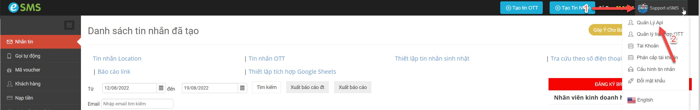

# Lấy thông tin ApiKey và SecretKey

Trước khi sử dụng eSMS API vui lòng đăng ký tài khoản tại [esms.vn](https://esms.vn/) để lấy ApiKey và Secretkey. (Có ngay 5.000 VNĐ dùng thử)

Sau khi tạo xong tài khoản, quý khách đăng nhập và làm theo hướng dẫn ở bên dưới để lấy ApiKey và Secretkey.

